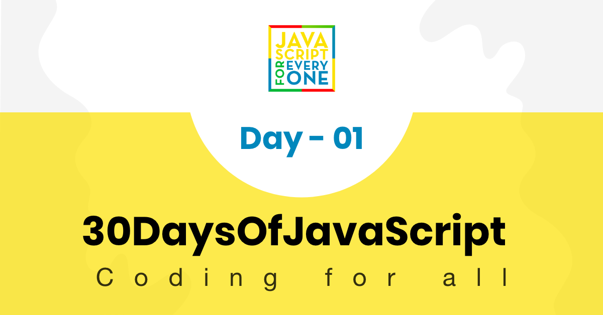
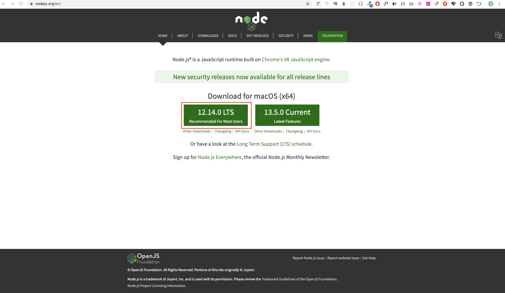
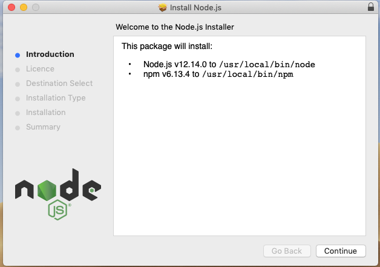
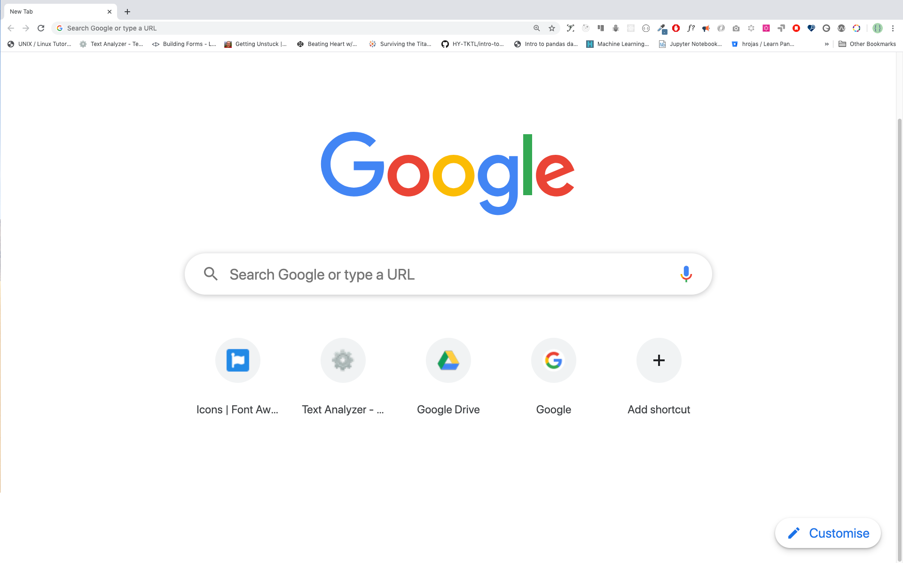
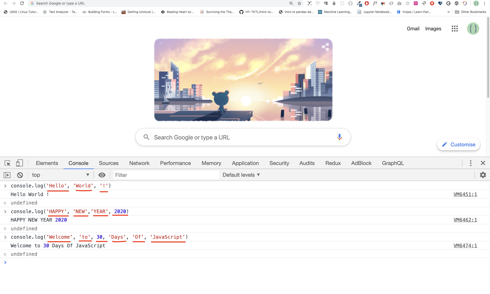
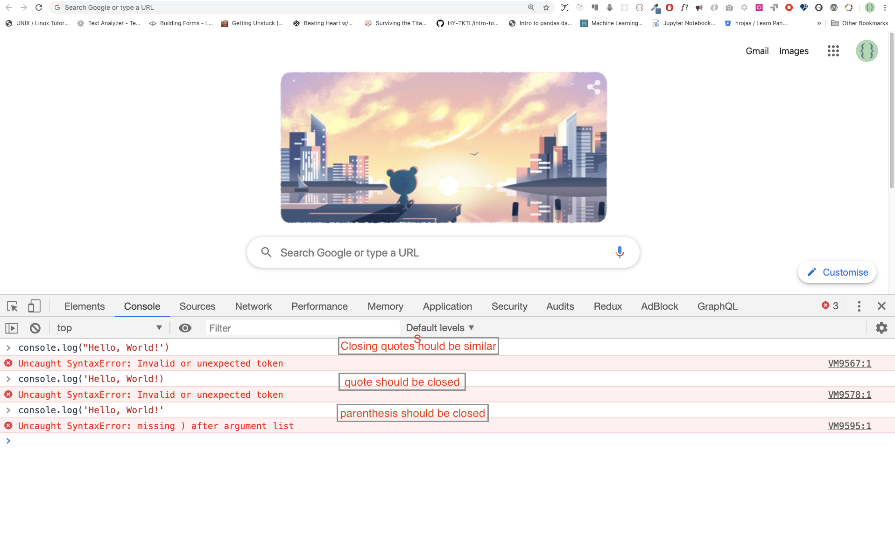
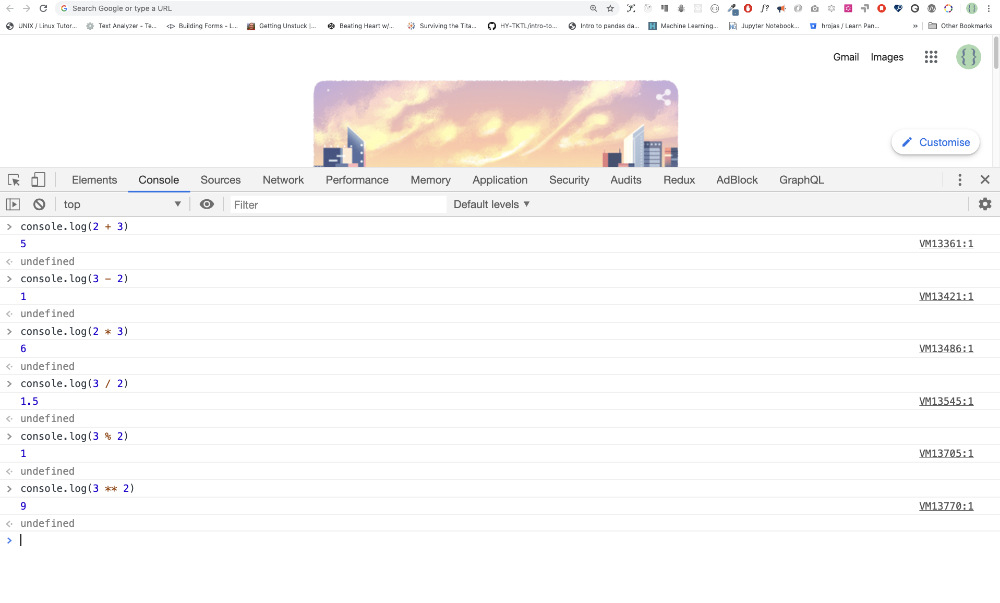
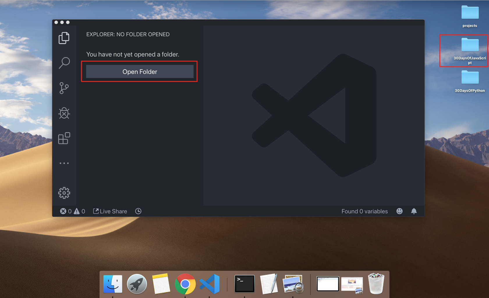
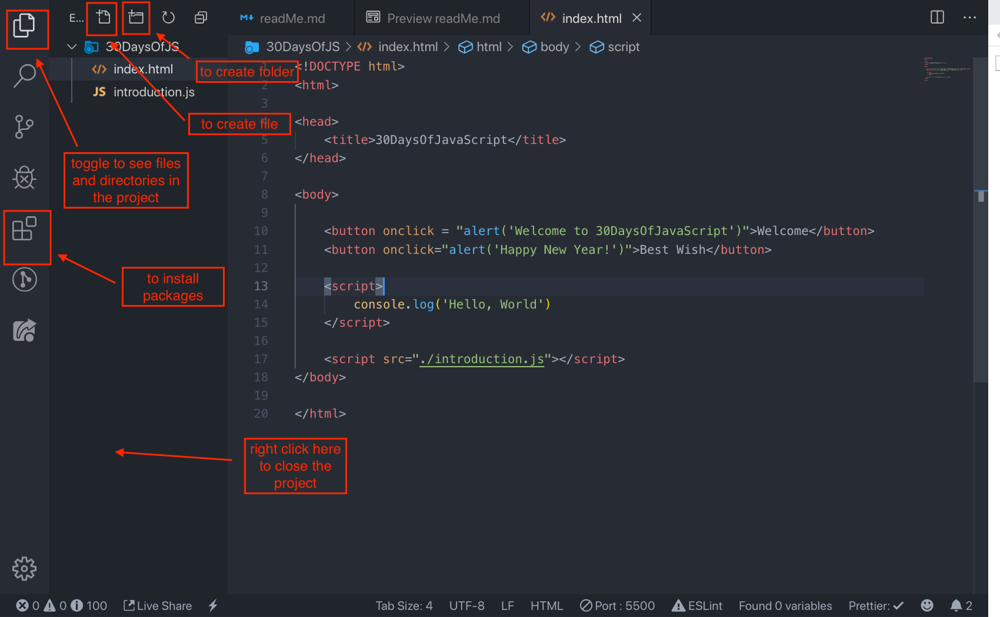
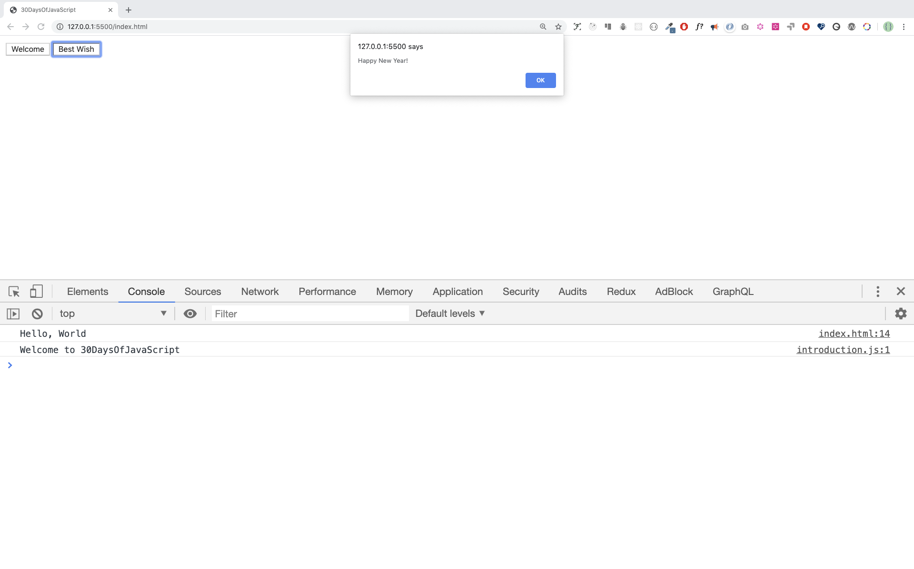

<<<<<<< HEAD
# Học JavaScript trong 30 ngày

| # Ngày |                                                                       Phần                                                                        |
| ----- | :-------------------------------------------------------------------------------------------------------------------------------------------------: |
| 01    |                                                             [Giới thiệu](./readMe.md)                                                             |
| 02    |                                               [Kiểu dữ liệu](./02_Day_Data_types/02_day_data_types.md)                                                |
| 03    |                             [Booleans, Toán tử, Date](./03_Day_Booleans_operators_date/03_booleans_operators_date.md)                             |
| 04    |                                            [Điều kiện](./04_Day_Conditionals/04_day_conditionals.md)                                             |
| 05    |                                                     [Mảng](./05_Day_Arrays/05_day_arrays.md)                                                      |
| 06    |                                                       [Vòng lặp](./06_Day_Loops/06_day_loops.md)                                                       |
| 07    |                                                 [Functions](./07_Day_Functions/07_day_functions.md)                                                 |
| 08    |                                                    [Objects](./08_Day_Objects/08_day_objects.md)                                                    |
| 09    |                             [Đào sâu vào Functions](./09_Day_Higher_order_functions/09_day_higher_order_functions.md)                              |
| 10    |                                           [Sets và Maps](./10_Day_Sets_and_Maps/10_day_Sets_and_Maps.md)                                           |
| 11    |                      [Destructuring và Spreading](./11_Day_Destructuring_and_spreading/11_day_destructuring_and_spreading.md)                      |
| 12    |                                  [Biểu thức chính quy](./12_Day_Regular_expressions/12_day_regular_expressions.md)                                  |
| 13    |                             [Phương thức Console Object](./13_Day_Console_object_methods/13_day_console_object_methods.md)                              |
| 14    |                                         [Error Handling](./14_Day_Error_handling/14_day_error_handling.md)                                          |
| 15    |                                                    [Classes](./15_Day_Classes/15_day_classes.md)                                                    |
| 16    |                                                        [JSON](./16_Day_JSON/16_day_json.md)                                                         |
| 17    |                                            [Web Storages](./17_Day_Web_storages/17_day_web_storages.md)                                             |
| 18    |                                                  [Promises](./18_Day_Promises/18_day_promises.md)                                                   |
| 19    |                                                   [Closure](./19_Day_Closures/19_day_closures.md)                                                   |
| 20    |                                  [Viết Clean Code](./20_Day_Writing_clean_codes/20_day_writing_clean_codes.md)                                   |
| 21    |                                                          [DOM](./21_Day_DOM/21_day_dom.md)                                                          |
| 22    |                            [Thao tác với DOM Object](./22_Day_Manipulating_DOM_object/22_day_manipulating_DOM_object.md)                            |
| 23    |                                        [Event Listeners](./23_Day_Event_listeners/23_day_event_listeners.md)                                        |
| 24    |                             [Dự án nhỏ: Hệ mặt trời](./24_Day_Project_solar_system/24_day_project_solar_system.md)                              |
| 25    | [Dự án nhỏ: Hiển thị dữ liệu các quốc gia trên thế giới 1](./25_Day_World_countries_data_visualization_1/25_day_world_countries_data_visualization_1.md) |
| 26    | [Dự án nhỏ: Hiển thị dữ liệu các quốc gia trên thế giới 2](./26_Day_World_countries_data_visualization_2/26_day_world_countries_data_visualization_2.md) |
| 27    |                             [Dự án nhỏ: Portfolio](./27_Day_Mini_project_portfolio/27_day_mini_project_portfolio.md)                             |
| 28    |                          [Dự án nhỏ: Bảng xếp hạng](./28_Day_Mini_project_leaderboard/28_day_mini_project_leaderboard.md)                          |
| 29    |             [Dự án nhỏ:Nhân vật hoạt hình](./29_Day_Mini_project_animating_characters/29_day_mini_project_animating_characters.md)             |
| 30    |                                     [Dự án cuối cùng](./30_Day_Mini_project_final/30_day_mini_project_final.md)                                      |

🧡🧡🧡 CHÚC BẠN CODE VUI VẺ 🧡🧡🧡

<div>
    <small>Ủng hộ <strong>tác giả</strong> để bổ sung thêm nhiều kiến thức bổ ích</small> <br />  
    <a href="https://www.paypal.me/asabeneh">
      
    </a>
</div>

<div align="center">
    <h1> Học JavaScript trong 30 ngày: Giới thiệu</h1>
    <a class="header-badge" target="_blank" href="https://www.linkedin.com/in/asabeneh/">
        
    </a>
    <a class="header-badge" target="_blank" href="https://twitter.com/Asabeneh">
        
    </a>
    <br>
    <sub>Tác giả:
        <a href="https://www.linkedin.com/in/asabeneh/" target="_blank">Asabeneh Yetayeh</a><br>
        <small> Tháng 1, 2020</small>
    </sub>
<div>

🇬🇧 [Tiếng Anh](./readMe.md)
🇪🇸 [Tiếng Tây Ban Nha](./Spanish/readme.md)
🇷🇺 [Tiếng Nga](./RU/README.md)
KR [Tiếng Hàn](./Korea/README.md)

</div>

</div>
</div>

[Ngày 2 >>](./02_Day_Data_types/02_day_data_types.md)



- [Học JavaScript trong 30 ngày](#30-days-of-javascript)
- [📔 Ngày 1](#-day-1)
	- [Giới thiệu](#introduction)
	- [Yêu cầu](#requirements)
	- [Thiết lập](#setup)
		- [Cài Node.js](#install-nodejs)
		- [Trình duyệt](#browser)
			- [Cài Google Chrome](#installing-google-chrome)
			- [Mở Console Google Chrome](#opening-google-chrome-console)
			- [Viết code trên Console trình duyệt](#writing-code-on-browser-console)
				- [Console.log](#consolelog)
				- [Console.log có nhiều tham số](#consolelog-with-multiple-arguments)
				- [Comments](#comments)
				- [Cú pháp](#syntax)
			- [Toán tử](#arithmetics)
		- [Code Editor](#code-editor)
			- [Cài Visual Studio Code](#installing-visual-studio-code)
			- [Cách sử dụng Visual Studio Code](#how-to-use-visual-studio-code)
	- [Thêm JavaScript vào trang web](#adding-javascript-to-a-web-page)
		- [Inline Script](#inline-script)
		- [Internal Script](#internal-script)
		- [External Script](#external-script)
		- [Nhiều External Scripts](#multiple-external-scripts)
	- [Giới thiệu về Kiểu dữ liệu](#introduction-to-data-types)
		- [Numbers](#numbers)
		- [Strings](#strings)
		- [Booleans](#booleans)
		- [Undefined](#undefined)
		- [Null](#null)
	- [Xác định kiểu dữ liệu](#checking-data-types)
	- [Comments tiếp](#comments-again)
	- [Biến](#variables)
- [💻 Ngày 1: Bài tập](#-day-1-exercises)

# 📔 Ngày 1

## Giới thiệu

**Chúc mừng bạn** đã quyết định tham gia học JavaScript trong 30 ngày. Trong thử thách này, bạn sẽ học mọi thứ bạn cần để trở thành một lập trình viên JavaScript, toàn bộ khái niệm về lập trình. Cuối thử thách, bạn sẽ nhận được chứng chỉ hoàn thành thử thách lập trình 30DaysOfJavaScript. Trong trường hợp bạn cần giúp đỡ hoặc nếu bạn muốn giúp đỡ người khác, bạn có thể tham gia [nhóm Telegram](https://t.me/ThirtyDaysOfJavaScript).

Thử thách **30DaysOfJavaScript** là để hướng dẫn cho cả người mới học và các lập trình viên JavaScript nâng cao. Chào bạn đến với JavaScript. JavaScript là ngôn ngữ lập trình của web. Tôi thích sử dụng và chia sẻ kiến thức về JavaScript và tôi hy vọng bạn cũng sẽ làm như vậy.

Trong các thử thách JavaScript này, bạn sẽ học JavaScript, ngôn ngữ lập trình phổ biến nhất thế giới đến thời điểm hiện tại.
JavaScript sử dụng để **_thêm tính tương tác cho các trang web, để phát triển ứng dụng di động, ứng dụng máy tính để bàn, trò chơi_** và ngày nay JavaScript có thể được sử dụng cho **_machine learning_** and **_AI_**.
**_JavaScript (JS)_** ngày càng phổ biến trong những năm gần đây và dẫn đầu các ngôn ngữ lập trình trong 6 năm liên tiếp và là ngôn ngữ lập trình được sử dụng nhiều nhất trên Github.

## Yêu cầu

Bạn không cần phải có kiến thức về lập trình để bắt đầu thử thách này, bạn chỉ cần có:

1. Động lực
2. Máy tính (Laptop)
3. Kết nối mạng
4. Trình duyệt
5. Code editor (VSCode)

## Thiết lập

Tôi tin rằng bạn có động lực và muốn trở thành một lập trình viên, máy tính và kết nối mạng. Nếu bạn đã có đầy đủ thì chúng ta hãy bắt đầu.

### Cài Node.js

Bạn có thể không cần phải cài Node.js ngay bây giờ nhưng sau này thì có thể cần đến. Cài [Node.js](https://nodejs.org/en/).



Sau khi tải xong, nhấn đúp để cài đặt



Chúng ta có thể kiểm tra xem Node đã cài hay chưa bằng cách mở terminal hoặc cmd trên máy tính.

```sh
$ node -v
v12.14.0
```

Khi làm bài hướng dẫn này tôi đang sử dụng phiên bản Node 12.14.0, nhưng hiện tại phiên bản Node.js được đề xuất để tải xuống là v17.6.0, bạn có thể sử dụng phiên bản Node mới nhất.

### Trình duyệt

Hiện tại có rất nhiều trình duyệt web, tuy nhiên tôi đề xuất nên sử dụng Google Chrome.

#### Cài Google Chrome

Cài [Google Chrome](https://www.google.com/chrome/) nếu bạn chưa cài nó. Chúng ta có thể viết code JavaScript trên console trình duyệt, nhưng chúng ta không sử dụng console trình duyệt để lập trình.



#### Mở Console Google Chrome


Bạn có thể mở console Google Chrome bằng cách nhấp vào ba dấu chấm ở trên cùng bên phải trình duyệt, chọn _More tools -> Developer tools_ hoặc sử dụng phím tắt.


Để mở Console Google Chrome bằng phím tắt:

```sh
Mac
Command+Option+J

Windows/Linux:
Ctl+Shift+J (hoặc F12)
```


Sau khi bạn mở console Google Chrome, hãy thử khám phá các nút được đánh dấu bên dưới. Chúng ta sẽ dành phần lớn thời gian trên Console. Console là nơi bạn viết code JavaScript. Công cụ Google Console V8 sẽ chuyển code của bạn thành mã máy.
Bây giờ chúng ta sẽ viết mã JavaScript trên console của Google Chrome:


#### Viết code trên Console của trình duyệt

Chúng ta có thể viết bất kỳ code JavaScript nào trên console của Google hoặc bất kỳ console của trình duyệt nào. Tuy nhiên, đối với thử thách này, chúng ta chỉ sử dụng console của Google Chrome. Mở console bằng cách sử dụng:

```sh
Mac
Command+Option+I

Windows:
Ctl+Shift+I (hoặc F12)
```

##### Console.log

Để viết code JavaScript, chúng ta sẽ sử dụng 1 hàm có sẵn là **console.log()**. Chúng ta sẽ truyền vào một tham số và hàm sẽ hiển thị kết quả đã truyền vào. Chúng ta sẽ truyền `'Hello, World'` dưới dạng là tham số vào hàm `console.log()`.

```js
console.log('Hello, World!')
```

##### Console.log có nhiều tham số

Hàm **`console.log()`** có thể nhận nhiều tham số được phân cách bằng dấu phẩy. Cú pháp sẽ giống như này:**`console.log(param1, param2, param3)`**



```js
console.log('Hello', 'World', '!')
console.log('MỪNG', 'NGÀY', '8/3', 2022)
console.log('Chào bạn', 'đến với ', 30, 'Days', 'Of', 'JavaScript')
```

Bạn có thể thấy đoạn code bên trên, hàm _`console.log()`_ có thể nhận nhiều tham số.

Chúc mừng! Bạn đã viết code JavaScript bằng cách sử dụng _`console.log()`_.

##### Comments

Chúng ta có thể thêm comment vào code. Comment rất quan trọng để làm cho code dễ đọc hơn và để lại nhận xét trong code. JavaScript không chạy phần đã comment trong code. Trong JavaScript, bất kỳ dòng nào bắt đầu bằng `//` trong JavaScript đều là một comment, và bất kỳ cái gì kèm theo như thế này `//` đều là comment.

**Ví dụ: Comment 1 dòng**

```js
// Đây là comment thứ nhất  
// Đây là comment thứ hai  
// Đây là comment 1 dòng
```

**Ví dụ: Comment nhiều dòng**

```js
/*
 Đây là comment nhiều dòng 
 Comment nhiều dòng có thể có nhiều dòng 
 JavaScript là ngôn ngữ của web  
 */
```

##### Cú pháp

Ngôn ngữ lập trình tương tự như ngôn ngữ của con người. Tiếng Việt hoặc nhiều ngôn ngữ khác sử dụng các từ, cụm từ, câu, câu ghép và nhiều ngôn ngữ khác để truyền tải một thông điệp có ý nghĩa. Ý nghĩa cú pháp trong tiếng Việt là _sự sắp xếp các từ và cụm từ để tạo ra các câu có cấu trúc trong một ngôn ngữ_. Định nghĩa kỹ thuật của cú pháp là cấu trúc của các câu lệnh trong một ngôn ngữ máy tính. Ngôn ngữ lập trình cũng có cú pháp. JavaScript là một ngôn ngữ lập trình và giống như các ngôn ngữ lập trình khác, nó có cú pháp riêng. Nếu chúng ta không viết một cú pháp mà JavaScript hiểu, nó sẽ phát sinh các loại lỗi khác nhau. Chúng ta sẽ khám phá các loại lỗi trong JavaScript khác nhau ở phần sau. Bây giờ, hãy xem 1 cú pháp bị lỗi bên dưới.



Tôi đã phạm một sai lầm có chủ ý. Kết quả là console làm tăng lỗi cú pháp. Trên thực tế, cú pháp rất nhiều thông tin. Nó thông báo loại sai lầm đã được thực hiện. Bằng cách đọc hướng dẫn phản hồi lỗi, chúng ta có thể sửa cú pháp và khắc phục sự cố. Quá trình xác định và loại bỏ lỗi khỏi chương trình được gọi là gỡ lỗi (debug). Bây giờ chúng ta sẽ gỡ lỗi:

```js
console.log('Hello, World!')
console.log('Hello, World!')
```

Hiện tại, chúng ta đã thấy cách hiển thị văn bản bằng cách sử dụng _`console.log()`_. Nếu chúng ta in văn bản hoặc chuỗi bằng cách sử dụng _`console.log()`_, văn bản phải nằm trong dấu nháy đơn, dấu ngoặc kép hoặc que ngược.

**Ví dụ:**

```js
console.log('Hello, World!')
console.log("Hello, World!")
console.log(`Hello, World!`)
```

#### Toán tử

Bây giờ, chúng ta sẽ viết code JavaScript nhiều hơn bằng cách sử dụng _`console.log()`_ trên console của Google Chrome cho các kiểu dữ liệu số. Ngoài văn bản, chúng ta cũng có thể thực hiện các phép tính toán bằng JavaScript. Chúng ta sẽ thực hiện các phép tính đơn giản sau. Có thể viết code JavaScript trên console Google Chrome trực tiếp mà không cần hàm **_`console.log()`_**. Tuy nhiên, nó được đưa vào phần này vì hầu hết thử thách này sẽ diễn ra trong code editor, nơi việc sử dụng hàm là bắt buộc.



```js
console.log(2 + 3) // Cộng
console.log(3 - 2) // Trừ
console.log(2 * 3) // Nhân
console.log(3 / 2) // Chia
console.log(3 % 2) // Chia lấy dư
console.log(3 ** 2) // Luỹ thừa 3 ** 2 == 3 * 3
```

### Code Editor

Chúng ta có thể viết code trên console của trình duyệt, nhưng nó sẽ không dành cho các dự án lớn hơn. Trong môi trường làm việc thực tế, các lập trình viên sử dụng các code editor khác nhau để viết code. Trong thử thách Học JavaScript trong 30 ngày này, chúng ta sẽ sử dụng Visual Studio Code.

#### Cài Visual Studio Code

Visual Studio Code là một trình soạn thảo văn bản nguồn mở rất phổ biến. Tôi muốn giới thiệu bạn [tải Visual Studio Code](https://code.visualstudio.com/), nhưng nếu bạn muốn sử dụng các editor, hãy thoải mái làm theo những gì bạn có.


Nếu bạn đã cài đặt Visual Studio Code, bây giờ chúng ta sẽ sử dụng nó.

#### Cách sử dụng Visual Studio Code

Mở Visual Studio Code bằng cách nhấp đúp vào biểu tượng. Khi đã mở, bạn sẽ thấy giao diện như này. Hãy làm quen với các phần mà được đánh dấu.










## Thêm JavaScript vào trang web

JavaScript có thể thêm vào trang web bằng 3 cách:

- **_Inline script_**
- **_Internal script_**
- **_External script_**
- **_Multiple External scripts_**

Các phần sau đây sẽ hướng dẫn các cách khác nhau để thêm code JavaScript vào trang web.

### Inline Script

Tạo thư mục trên màn hình hoặc ở bất kỳ vị trí nào, đặt tên là 30DaysOfJS và tạo tệp có tên **_`index.html`_**. Sau đó, dán mã sau và mở nó trong trình duyệt, ví dụ [Chrome](https://www.google.com/chrome/).

```html
<!DOCTYPE html>
<html lang="vi">
  <head>
    <title>30DaysOfScript:Inline Script</title>
  </head>
  <body>
    <button onclick="alert('Chào bạn đến với 30DaysOfJavaScript!')">Nhấp vàod đây</button>
  </body>
</html>
```

Bây giờ, bạn vừa viết inline script (nhúng trực tiếp) đầu tiên của mình. Chúng tôi có thể tạo một popup cảnh báo bằng cách sử dụng hàm có sẵn _`alert()`_ .

### Internal Script

Internal Script có thể được viết trong thẻ _`head`_ hoặc _`body`_, nhưng nó sẽ được ưu tiên chạy trước khi viết trong phần body của tệp HTML.
Trước tiên, chúng ta hãy viết trên phần head của trang.

```html
<!DOCTYPE html>
<html lang="vi">
  <head>
    <title>30DaysOfScript:Internal Script</title>
    <script>
      console.log('Chào bạn đến với 30DaysOfJavaScript')
    </script>
  </head>
  <body></body>
</html>
```

Đây là cách chúng ta sẽ viết Inernal Script trong thử thách này. Viết code JavaScript trong phần body là tùy chọn ưu tiên nhất. Mở console của trình duyệt để xem kết quả từ `console.log()`.

```html
<!DOCTYPE html>
<html lang="vi">
  <head>
    <title>30DaysOfScript:Internal Script</title>
  </head>
  <body>
    <button onclick="alert('Chào bạn đến với 30DaysOfJavaScript!');">Click Me</button>
    <script>
      console.log('Chào bạn đến với 30DaysOfJavaScript')
    </script>
  </body>
</html>
```

Mở console của trình duyệt để xem kết quả từ `console.log()`.


### External Script

Tương tự như Internal Script, External Script có thể nằm trên header hoặc body, nhưng tốt hơn là đặt nó trong phần body.
Đầu tiên, chúng ta sẽ tạo một tệp JavaScript có đuôi là `.js`. Tất cả tệp JavaScript đều có đuôi là `.js`. Tạo một tệp có tên là `Introduction.js` bên trong thư mục vừa nảy bạn đã tạo và viết code sau và nhúng tệp .js này vào cuối phần body.

```js
console.log('Chào bạn đến với 30DaysOfJavaScript')
```

Nhúng External scripts trong thẻ _head_:

```html
<!DOCTYPE html>
<html lang="vi">
  <head>
    <title>30DaysOfJavaScript:External script</title>
    <script src="introduction.js"></script>
  </head>
  <body></body>
</html>
```

Nhúng External scripts trong thẻ _body_:

```html
<!DOCTYPE html>
<html lang="en">
  <head>
    <title>30DaysOfJavaScript:External script</title>
  </head>
  <body>
    <!-- Liên kết bên ngoài JavaScript có thể nằm trong header hoặc trong body --> 
    <!-- Trước thẻ đóng của phần body là nơi được khuyến nghị để nhúng các tệp JavaScript bên ngoài -->
    <script src="introduction.js"></script>
  </body>
</html>
```

Mở console trình duyệt để xem kết quả của `console.log()`.

### Nhúng nhiều External Scripts

Chúng ta cũng có thể nhúng nhiều tệp JavaScript bên ngoài trong một trang web.
Tạo tệp `helloworld.js` trong thư mục 30DaysOfJS và viết theo code bên dưới.

```js
console.log('Hello, World!')
```

```html
<!DOCTYPE html>
<html lang="vi">
  <head>
    <title>Multiple External Scripts</title>
  </head>
  <body>
    <script src="./helloworld.js"></script>
    <script src="./introduction.js"></script>
  </body>
</html>
```

_Tệp main.js của bạn phải nằm bên dưới tất cả các script khác_. Điều rất quan trọng là phải nhớ điều này.


## Giới thiệu các kiểu các dữ liệu

Trong JavaScript và các ngôn ngữ lập trình khác, có nhiều kiểu dữ liệu khác nhau. Sau đây là các kiểu dữ liệu nguyên thủy của JavaScript: _String, Number, Boolean, undefined, Null_, và _Symbol_.

### Numbers (số)

- Số nguyên: Số nguyên (âm, 0 và dương)
  Ví dụ:
  ... -3, -2, -1, 0, 1, 2, 3 ...
- Số thập phân
  Ví dụ
  ... -3.5, -2.25, -1.0, 0.0, 1.1, 2.2, 3.5 ...

### Strings (Chuỗi)

Tập hợp một hoặc nhiều ký tự nằm giữa hai nháy đơn, dấu nháy kép hoặc gạch chéo.

**Ví dụ:**

```js
'a'
'Asabeneh'
"Asabeneh"
'Việt Nam'
'JavaScript là ngôn ngữ lập trình tuyệt nhất'
'Tôi thích chia sẻ'
'Tôi hy vọng bạn đang tận hưởng ngày đầu tiên'
`Chúng ta cũng có thể tạo một chuỗi bằng cách sử dụng một gạch chéo`
'Một chuỗi có thể chỉ nhỏ bằng một ký tự hoặc lớn bằng nhiều trang'
'Bất kỳ loại dữ liệu nào dưới dấu nháy đơn, dấu nháy kép hoặc gạch chéo đều là một chuỗi'
```

### Booleans

Giá trị boolean là `True` hoặc `False`. Mọi phép so sánh đều trả về giá trị boolean, đúng hoặc sai.

Kiểu dữ liệu boolean là giá trị `true` hoặc `false`.

**Ví dụ:**

```js
true // nếu đèn sáng, giá trị là true
false // nếu đèn tắt, giá trị là false
```

### Undefined

Trong JavaScript, nếu chúng ta không gán giá trị cho một biến thì giá trị đó không được xác định. Ngoài ra, nếu một hàm không trả về bất cứ thứ gì, nó sẽ trả về không xác định.

```js
let firstName
console.log(firstName) // undefined, bởi vì nó chưa được gán cho một giá trị nào
```

### Null

Null trong JavaScript có nghĩa là một biến rỗng.

```js
let emptyValue = null
```

## Xác định kiểu dữ liệu

Để kiểm tra kiểu dữ liệu của một biến, chúng ta sử dụng **typeof**. Xem ví dụ bên dưới.

```js
console.log(typeof 'Asabeneh') // string
console.log(typeof 5) // number
console.log(typeof true) // boolean
console.log(typeof null) // object type
console.log(typeof undefined) // undefined
```

## Comments lần nữa

Hãy nhớ rằng comment trong JavaScript cũng tương tự như các ngôn ngữ lập trình khác. Comment rất quan trọng trong việc làm cho code của bạn dễ đọc hơn.
Có hai cách comment:

- _Comment 1 dòng_
- _Comment nhiều dòng_

```js
// comment chính nó là một comment 1 dòng
// let firstName = 'Asabeneh'; comment 1 dòng
// let lastName = 'Yetayeh'; comment 1 dòng
```

Comment nhiều dòng:

```js
/*
  let location = 'Helsinki';
  let age = 100;
  let isMarried = true;
  Đây là comment nhiều dòng
*/
```

## Biến

Biến là _vùng chứa_ của dữ liệu. Các biến được sử dụng để _lưu trữ_ dữ liệu trong vị trí bộ nhớ. Khi một biến được khai báo, một vị trí bộ nhớ được dành riêng. Khi gán giá trị (dữ liệu) cho một biến, không gian bộ nhớ sẽ được lấp đầy bởi dữ liệu đó. Để khai báo một biến, chúng ta sử dụng các từ khóa _var_, _let_, hoặc _const_.

Đối với một biến chúng ta cần thay đổi dữ liệu sau này, chúng ta sử dụng _let_. Nếu dữ liệu của biến đó không cần thay đổi thì chúng ta sử dụng _const_. Ví dụ, PI, tên quốc gia, trọng lực, các đối tượng này không thay đổi dữ liệu thì dùng _const_. Chúng ta sẽ không sử dụng `var` trong thử thách này và tôi không khuyên bạn nên sử dụng nó. Đây là cách dễ bị lỗi khi khai báo biến, nó có rất nhiều lỗ hổng. Chúng ta sẽ nói chi tiết hơn về `var`, `let` và `const` trong các phần khác. Còn bây giờ, lời giải thích trên là đủ.

Tên biến JavaScript hợp lệ phải tuân theo các quy tắc sau:

- Tên biến JavaScript không được bắt đầu bằng một số.
- Tên biến JavaScript không được có ký tự đặc biệt ngoại trừ ký tự $ và dấu gạch dưới _.
- Tên biến JavaScript tuân theo quy ước camelCase.
- Tên biến JavaScript không được có khoảng trắng giữa các từ.

Sau đây là các ví dụ về các biến JavaScript hợp lệ.

```js
firstName
lastName
country
city
capitalCity
age
isMarried

first_name
last_name
is_married
capital_city

num1
num_1
_num_1
$num1
year2020
year_2020
```

Hai biến đầu tiên bên trên tuân theo quy ước camelCase về khai báo trong JavaScript. Trong tài liệu này, chúng tôi sẽ sử dụng các biến camelCase (camelWithOneHump). Chúng ta sử dụng CamelCase (CamelWithTwoHump) để khai báo các lớp, chúng ta sẽ thảo luận về các lớp và đối tượng trong phần khác.

Ví dụ về các biến không hợp lệ:

```js
  first-name
  1_num
  num_#_1
```

Chúng ta hãy khai báo các biến với các kiểu dữ liệu khác nhau. Để khai báo 1 biến, sử dụng từ khoá _let_ hoặc _const_ trước tên biến. Theo sau tên biến, chúng ta viết một dấu bằng (toán tử gán) và một giá trị (dữ liệu được gán).

```js
// Cú pháp
let tenBien = giatri
```

Tên biến là tên lưu trữ các dữ liệu có giá trị khác nhau. Xem bên dưới để biết các ví dụ chi tiết.

**Ví dụ về khai báo biến**

```js
// Khai báo biến với các kiểu dữ liệu các nhau
let firstName = 'Đạt' // tên của 1 người
let lastName = 'Ngô Quốc' // họ của 1 người
let country = 'Việt Nam' // quốc gia
let city = 'Hà Nội' // thủ đô
let age = 19 // tuổi
let isMarried = false // đã cưới hay chưa

console.log(firstName, lastName, country, city, age, isMarried)
```

```sh
Đạt Ngô Quốc Việt Nam Hà Nội 19 false
```

```js
// Khai báo biến với kiểu dữ liệu số
let age = 100 // tuổi
const gravity = 9.81 // trọng lực trái đất m/s2
const boilingPoint = 100 // độ sôi của nước, nhiệt độ tính bằng °C
const PI = 3.14 // số PI
console.log(gravity, boilingPoint, PI)
```

```sh
9.81 100 3.14
```

```js
// Bạn cũngc có thể khai báo biến trên 1 dòng phân cách bằng dấu phẩy, tuy nhiên, tôi khuyên bạn nên sử dụng một dòng riêng biệt để làm cho code dễ đọc hơn
let name = 'Ngô Quốc Đạt', job = 'developer', live = 'Việt Nam'
console.log(name, job, live)
```

```sh
Ngô Quốc Đạt developer Việt Nam
```

Khi bạn chạy tệp _index.html_ trong thư mục 01-Day bạn sẽ thấy như này:


🌕 Bạn thật tuyệt! Bạn vừa hoàn thành thử thách ngày 1 và bạn đang trên đường vươn tới sự vĩ đại. Bây giờ hãy thực hiện một số bài tập cho não và cơ bắp của bạn.

# 💻 Ngày 1: Bài tập

1. Viết 1 dòng comment nói là, _comment làm code dễ đọc hơn_
2. Viết 1 dòng comment khác nói là, _Chào mừng bạn đến với 30DaysOfJavaScript_
3. Viết comment nhiều dòng nói là, _comment làm code dễ đọc hơn, dễ sử dụng lại_ _và chi tiết_
4. Tạo tệp `variable.js` và khai báo các biến và gán các kiểu dữ liệu `string`, `boolean`, `undefined` và `null`.
5. Tạo tệp `datatypes.js` và sử dụng **_typeof_** để kiểm tra các kiểu dữ liệu khác nhau. Kiểm tra kiểu dữ liệu của từng biến.
6. Khai báo 4 biến không gán giá trị
7. Khai báo 4 biến có gán giá trị
8. Khai báo các biến để lưu trữ họ, tên, tình trạng hôn nhân, quốc gia và tuổi của bạn trong nhiều dòng
9. Khai báo các biến để lưu trữ họ, tên, tình trạng hôn nhân, quốc gia và tuổi của bạn trong một dòng duy nhất
10. Khai báo 2 biến _myAge_ và _yourAge_ và gán giá trị cho nó, và xuất nó ra trên console của trình duyệt.

```sh
I am 25 years old.
You are 30 years old.
```

🎉 CHÚC MỪNG ! 🎉

[Ngày 2 >>](./02_Day_Data_types/02_day_data_types.md)
=======
# Học JavaScript trong 30 ngày

| # Ngày |                                                                       Phần                                                                        |
| ----- | :-------------------------------------------------------------------------------------------------------------------------------------------------: |
| 01    |                                                             [Giới thiệu](./readMe.md)                                                             |
| 02    |                                               [Kiểu dữ liệu](./02_Day_Data_types/02_day_data_types.md)                                                |
| 03    |                             [Booleans, Toán tử, Date](./03_Day_Booleans_operators_date/03_booleans_operators_date.md)                             |
| 04    |                                            [Điều kiện](./04_Day_Conditionals/04_day_conditionals.md)                                             |
| 05    |                                                     [Mảng](./05_Day_Arrays/05_day_arrays.md)                                                      |
| 06    |                                                       [Vòng lặp](./06_Day_Loops/06_day_loops.md)                                                       |
| 07    |                                                 [Functions](./07_Day_Functions/07_day_functions.md)                                                 |
| 08    |                                                    [Objects](./08_Day_Objects/08_day_objects.md)                                                    |
| 09    |                             [Đào sâu vào Functions](./09_Day_Higher_order_functions/09_day_higher_order_functions.md)                              |
| 10    |                                           [Sets và Maps](./10_Day_Sets_and_Maps/10_day_Sets_and_Maps.md)                                           |
| 11    |                      [Destructuring và Spreading](./11_Day_Destructuring_and_spreading/11_day_destructuring_and_spreading.md)                      |
| 12    |                                  [Biểu thức chính quy](./12_Day_Regular_expressions/12_day_regular_expressions.md)                                  |
| 13    |                             [Phương thức Console Object](./13_Day_Console_object_methods/13_day_console_object_methods.md)                              |
| 14    |                                         [Error Handling](./14_Day_Error_handling/14_day_error_handling.md)                                          |
| 15    |                                                    [Classes](./15_Day_Classes/15_day_classes.md)                                                    |
| 16    |                                                        [JSON](./16_Day_JSON/16_day_json.md)                                                         |
| 17    |                                            [Web Storages](./17_Day_Web_storages/17_day_web_storages.md)                                             |
| 18    |                                                  [Promises](./18_Day_Promises/18_day_promises.md)                                                   |
| 19    |                                                   [Closure](./19_Day_Closures/19_day_closures.md)                                                   |
| 20    |                                  [Viết Clean Code](./20_Day_Writing_clean_codes/20_day_writing_clean_codes.md)                                   |
| 21    |                                                          [DOM](./21_Day_DOM/21_day_dom.md)                                                          |
| 22    |                            [Thao tác với DOM Object](./22_Day_Manipulating_DOM_object/22_day_manipulating_DOM_object.md)                            |
| 23    |                                        [Event Listeners](./23_Day_Event_listeners/23_day_event_listeners.md)                                        |
| 24    |                             [Dự án nhỏ: Hệ mặt trời](./24_Day_Project_solar_system/24_day_project_solar_system.md)                              |
| 25    | [Dự án nhỏ: Hiển thị dữ liệu các quốc gia trên thế giới 1](./25_Day_World_countries_data_visualization_1/25_day_world_countries_data_visualization_1.md) |
| 26    | [Dự án nhỏ: Hiển thị dữ liệu các quốc gia trên thế giới 2](./26_Day_World_countries_data_visualization_2/26_day_world_countries_data_visualization_2.md) |
| 27    |                             [Dự án nhỏ: Portfolio](./27_Day_Mini_project_portfolio/27_day_mini_project_portfolio.md)                             |
| 28    |                          [Dự án nhỏ: Bảng xếp hạng](./28_Day_Mini_project_leaderboard/28_day_mini_project_leaderboard.md)                          |
| 29    |             [Dự án nhỏ:Nhân vật hoạt hình](./29_Day_Mini_project_animating_characters/29_day_mini_project_animating_characters.md)             |
| 30    |                                     [Dự án cuối cùng](./30_Day_Mini_project_final/30_day_mini_project_final.md)                                      |

🧡🧡🧡 CHÚC BẠN CODE VUI VẺ 🧡🧡🧡

<div>
    <small>Ủng hộ <strong>tác giả</strong> để bổ sung thêm nhiều kiến thức bổ ích</small> <br />  
    <a href="https://www.paypal.me/asabeneh">
      
    </a>
</div>

<div align="center">
    <h1> Học JavaScript trong 30 ngày: Giới thiệu</h1>
    <a class="header-badge" target="_blank" href="https://www.linkedin.com/in/asabeneh/">
        
    </a>
    <a class="header-badge" target="_blank" href="https://twitter.com/Asabeneh">
        
    </a>
    <br>
    <sub>Tác giả:
        <a href="https://www.linkedin.com/in/asabeneh/" target="_blank">Asabeneh Yetayeh</a><br>
        <small> Tháng 1, 2020</small>
    </sub>
<div>

🇬🇧 [Tiếng Anh](./readMe.md)
🇪🇸 [Tiếng Tây Ban Nha](./Spanish/readme.md)
🇷🇺 [Tiếng Nga](./RU/README.md)
KR [Tiếng Hàn](./Korea/README.md)

</div>

</div>
</div>

[Ngày 2 >>](./02_Day_Data_types/02_day_data_types.md)


- [Học JavaScript trong 30 ngày](#30-days-of-javascript)
- [📔 Ngày 1](#-day-1)
	- [Giới thiệu](#introduction)
	- [Yêu cầu](#requirements)
	- [Thiết lập](#setup)
		- [Cài Node.js](#install-nodejs)
		- [Trình duyệt](#browser)
			- [Cài Google Chrome](#installing-google-chrome)
			- [Mở Console Google Chrome](#opening-google-chrome-console)
			- [Viết code trên Console trình duyệt](#writing-code-on-browser-console)
				- [Console.log](#consolelog)
				- [Console.log có nhiều tham số](#consolelog-with-multiple-arguments)
				- [Comments](#comments)
				- [Cú pháp](#syntax)
			- [Toán tử](#arithmetics)
		- [Code Editor](#code-editor)
			- [Cài Visual Studio Code](#installing-visual-studio-code)
			- [Cách sử dụng Visual Studio Code](#how-to-use-visual-studio-code)
	- [Thêm JavaScript vào trang web](#adding-javascript-to-a-web-page)
		- [Inline Script](#inline-script)
		- [Internal Script](#internal-script)
		- [External Script](#external-script)
		- [Nhiều External Scripts](#multiple-external-scripts)
	- [Giới thiệu về Kiểu dữ liệu](#introduction-to-data-types)
		- [Numbers](#numbers)
		- [Strings](#strings)
		- [Booleans](#booleans)
		- [Undefined](#undefined)
		- [Null](#null)
	- [Xác định kiểu dữ liệu](#checking-data-types)
	- [Comments tiếp](#comments-again)
	- [Biến](#variables)
- [💻 Ngày 1: Bài tập](#-day-1-exercises)

# 📔 Ngày 1

## Giới thiệu

**Chúc mừng bạn** đã quyết định tham gia học JavaScript trong 30 ngày. Trong thử thách này, bạn sẽ học mọi thứ bạn cần để trở thành một lập trình viên JavaScript, toàn bộ khái niệm về lập trình. Cuối thử thách, bạn sẽ nhận được chứng chỉ hoàn thành thử thách lập trình 30DaysOfJavaScript. Trong trường hợp bạn cần giúp đỡ hoặc nếu bạn muốn giúp đỡ người khác, bạn có thể tham gia [nhóm Telegram](https://t.me/ThirtyDaysOfJavaScript).

Thử thách **30DaysOfJavaScript** là để hướng dẫn cho cả người mới học và các lập trình viên JavaScript nâng cao. Chào bạn đến với JavaScript. JavaScript là ngôn ngữ lập trình của web. Tôi thích sử dụng và chia sẻ kiến thức về JavaScript và tôi hy vọng bạn cũng sẽ làm như vậy.

Trong các thử thách JavaScript này, bạn sẽ học JavaScript, ngôn ngữ lập trình phổ biến nhất thế giới đến thời điểm hiện tại.
JavaScript sử dụng để **_thêm tính tương tác cho các trang web, để phát triển ứng dụng di động, ứng dụng máy tính để bàn, trò chơi_** và ngày nay JavaScript có thể được sử dụng cho **_machine learning_** and **_AI_**.
**_JavaScript (JS)_** ngày càng phổ biến trong những năm gần đây và dẫn đầu các ngôn ngữ lập trình trong 6 năm liên tiếp và là ngôn ngữ lập trình được sử dụng nhiều nhất trên Github.

## Yêu cầu

Bạn không cần phải có kiến thức về lập trình để bắt đầu thử thách này, bạn chỉ cần có:

1. Động lực
2. Máy tính (Laptop)
3. Kết nối mạng
4. Trình duyệt
5. Code editor (VSCode)

## Thiết lập

Tôi tin rằng bạn có động lực và muốn trở thành một lập trình viên, máy tính và kết nối mạng. Nếu bạn đã có đầy đủ thì chúng ta hãy bắt đầu.

### Cài Node.js

Bạn có thể không cần phải cài Node.js ngay bây giờ nhưng sau này thì có thể cần đến. Cài [Node.js](https://nodejs.org/en/).


Sau khi tải xong, nhấn đúp để cài đặt


Chúng ta có thể kiểm tra xem Node đã cài hay chưa bằng cách mở terminal hoặc cmd trên máy tính.

```sh
$ node -v
v12.14.0
```

Khi làm bài hướng dẫn này tôi đang sử dụng phiên bản Node 12.14.0, nhưng hiện tại phiên bản Node.js được đề xuất để tải xuống là v17.6.0, bạn có thể sử dụng phiên bản Node mới nhất.

### Trình duyệt

Hiện tại có rất nhiều trình duyệt web, tuy nhiên tôi đề xuất nên sử dụng Google Chrome.

#### Cài Google Chrome

Cài [Google Chrome](https://www.google.com/chrome/) nếu bạn chưa cài nó. Chúng ta có thể viết code JavaScript trên console trình duyệt, nhưng chúng ta không sử dụng console trình duyệt để lập trình.


#### Mở Console Google Chrome


Bạn có thể mở console Google Chrome bằng cách nhấp vào ba dấu chấm ở trên cùng bên phải trình duyệt, chọn _More tools -> Developer tools_ hoặc sử dụng phím tắt.


Để mở Console Google Chrome bằng phím tắt:

```sh
Mac
Command+Option+J

Windows/Linux:
Ctl+Shift+J (hoặc F12)
```


Sau khi bạn mở console Google Chrome, hãy thử khám phá các nút được đánh dấu bên dưới. Chúng ta sẽ dành phần lớn thời gian trên Console. Console là nơi bạn viết code JavaScript. Công cụ Google Console V8 sẽ chuyển code của bạn thành mã máy.
Bây giờ chúng ta sẽ viết mã JavaScript trên console của Google Chrome:


#### Viết code trên Console của trình duyệt

Chúng ta có thể viết bất kỳ code JavaScript nào trên console của Google hoặc bất kỳ console của trình duyệt nào. Tuy nhiên, đối với thử thách này, chúng ta chỉ sử dụng console của Google Chrome. Mở console bằng cách sử dụng:

```sh
Mac
Command+Option+I

Windows:
Ctl+Shift+I (hoặc F12)
```

##### Console.log

Để viết code JavaScript, chúng ta sẽ sử dụng 1 hàm có sẵn là **console.log()**. Chúng ta sẽ truyền vào một tham số và hàm sẽ hiển thị kết quả đã truyền vào. Chúng ta sẽ truyền `'Hello, World'` dưới dạng là tham số vào hàm `console.log()`.

```js
console.log('Hello, World!')
```

##### Console.log có nhiều tham số

Hàm **`console.log()`** có thể nhận nhiều tham số được phân cách bằng dấu phẩy. Cú pháp sẽ giống như này:**`console.log(param1, param2, param3)`**


```js
console.log('Hello', 'World', '!')
console.log('MỪNG', 'NGÀY', '8/3', 2022)
console.log('Chào bạn', 'đến với ', 30, 'Days', 'Of', 'JavaScript')
```

Bạn có thể thấy đoạn code bên trên, hàm _`console.log()`_ có thể nhận nhiều tham số.

Chúc mừng! Bạn đã viết code JavaScript bằng cách sử dụng _`console.log()`_.

##### Comments

Chúng ta có thể thêm comment vào code. Comment rất quan trọng để làm cho code dễ đọc hơn và để lại nhận xét trong code. JavaScript không chạy phần đã comment trong code. Trong JavaScript, bất kỳ dòng nào bắt đầu bằng `//` trong JavaScript đều là một comment, và bất kỳ cái gì kèm theo như thế này `//` đều là comment.

**Ví dụ: Comment 1 dòng**

```js
// Đây là comment thứ nhất  
// Đây là comment thứ hai  
// Đây là comment 1 dòng
```

**Ví dụ: Comment nhiều dòng**

```js
/*
 Đây là comment nhiều dòng 
 Comment nhiều dòng có thể có nhiều dòng 
 JavaScript là ngôn ngữ của web  
 */
```

##### Cú pháp

Ngôn ngữ lập trình tương tự như ngôn ngữ của con người. Tiếng Việt hoặc nhiều ngôn ngữ khác sử dụng các từ, cụm từ, câu, câu ghép và nhiều ngôn ngữ khác để truyền tải một thông điệp có ý nghĩa. Ý nghĩa cú pháp trong tiếng Việt là _sự sắp xếp các từ và cụm từ để tạo ra các câu có cấu trúc trong một ngôn ngữ_. Định nghĩa kỹ thuật của cú pháp là cấu trúc của các câu lệnh trong một ngôn ngữ máy tính. Ngôn ngữ lập trình cũng có cú pháp. JavaScript là một ngôn ngữ lập trình và giống như các ngôn ngữ lập trình khác, nó có cú pháp riêng. Nếu chúng ta không viết một cú pháp mà JavaScript hiểu, nó sẽ phát sinh các loại lỗi khác nhau. Chúng ta sẽ khám phá các loại lỗi trong JavaScript khác nhau ở phần sau. Bây giờ, hãy xem 1 cú pháp bị lỗi bên dưới.


Tôi đã phạm một sai lầm có chủ ý. Kết quả là console làm tăng lỗi cú pháp. Trên thực tế, cú pháp rất nhiều thông tin. Nó thông báo loại sai lầm đã được thực hiện. Bằng cách đọc hướng dẫn phản hồi lỗi, chúng ta có thể sửa cú pháp và khắc phục sự cố. Quá trình xác định và loại bỏ lỗi khỏi chương trình được gọi là gỡ lỗi (debug). Bây giờ chúng ta sẽ gỡ lỗi:

```js
console.log('Hello, World!')
console.log('Hello, World!')
```

Hiện tại, chúng ta đã thấy cách hiển thị văn bản bằng cách sử dụng _`console.log()`_. Nếu chúng ta in văn bản hoặc chuỗi bằng cách sử dụng _`console.log()`_, văn bản phải nằm trong dấu nháy đơn, dấu ngoặc kép hoặc que ngược.

**Ví dụ:**

```js
console.log('Hello, World!')
console.log("Hello, World!")
console.log(`Hello, World!`)
```

#### Toán tử

Bây giờ, chúng ta sẽ viết code JavaScript nhiều hơn bằng cách sử dụng _`console.log()`_ trên console của Google Chrome cho các kiểu dữ liệu số. Ngoài văn bản, chúng ta cũng có thể thực hiện các phép tính toán bằng JavaScript. Chúng ta sẽ thực hiện các phép tính đơn giản sau. Có thể viết code JavaScript trên console Google Chrome trực tiếp mà không cần hàm **_`console.log()`_**. Tuy nhiên, nó được đưa vào phần này vì hầu hết thử thách này sẽ diễn ra trong code editor, nơi việc sử dụng hàm là bắt buộc.


```js
console.log(2 + 3) // Cộng
console.log(3 - 2) // Trừ
console.log(2 * 3) // Nhân
console.log(3 / 2) // Chia
console.log(3 % 2) // Chia lấy dư
console.log(3 ** 2) // Luỹ thừa 3 ** 2 == 3 * 3
```

### Code Editor

Chúng ta có thể viết code trên console của trình duyệt, nhưng nó sẽ không dành cho các dự án lớn hơn. Trong môi trường làm việc thực tế, các lập trình viên sử dụng các code editor khác nhau để viết code. Trong thử thách Học JavaScript trong 30 ngày này, chúng ta sẽ sử dụng Visual Studio Code.

#### Cài Visual Studio Code

Visual Studio Code là một trình soạn thảo văn bản nguồn mở rất phổ biến. Tôi muốn giới thiệu bạn [tải Visual Studio Code](https://code.visualstudio.com/), nhưng nếu bạn muốn sử dụng các editor, hãy thoải mái làm theo những gì bạn có.


Nếu bạn đã cài đặt Visual Studio Code, bây giờ chúng ta sẽ sử dụng nó.

#### Cách sử dụng Visual Studio Code

Mở Visual Studio Code bằng cách nhấp đúp vào biểu tượng. Khi đã mở, bạn sẽ thấy giao diện như này. Hãy làm quen với các phần mà được đánh dấu.


## Thêm JavaScript vào trang web

JavaScript có thể thêm vào trang web bằng 3 cách:

- **_Inline script_**
- **_Internal script_**
- **_External script_**
- **_Multiple External scripts_**

Các phần sau đây sẽ hướng dẫn các cách khác nhau để thêm code JavaScript vào trang web.

### Inline Script

Tạo thư mục trên màn hình hoặc ở bất kỳ vị trí nào, đặt tên là 30DaysOfJS và tạo tệp có tên **_`index.html`_**. Sau đó, dán mã sau và mở nó trong trình duyệt, ví dụ [Chrome](https://www.google.com/chrome/).

```html
<!DOCTYPE html>
<html lang="vi">
  <head>
    <title>30DaysOfScript:Inline Script</title>
  </head>
  <body>
    <button onclick="alert('Chào bạn đến với 30DaysOfJavaScript!')">Nhấp vàod đây</button>
  </body>
</html>
```

Bây giờ, bạn vừa viết inline script (nhúng trực tiếp) đầu tiên của mình. Chúng tôi có thể tạo một popup cảnh báo bằng cách sử dụng hàm có sẵn _`alert()`_ .

### Internal Script

Internal Script có thể được viết trong thẻ _`head`_ hoặc _`body`_, nhưng nó sẽ được ưu tiên chạy trước khi viết trong phần body của tệp HTML.
Trước tiên, chúng ta hãy viết trên phần head của trang.

```html
<!DOCTYPE html>
<html lang="vi">
  <head>
    <title>30DaysOfScript:Internal Script</title>
    <script>
      console.log('Chào bạn đến với 30DaysOfJavaScript')
    </script>
  </head>
  <body></body>
</html>
```

Đây là cách chúng ta sẽ viết Inernal Script trong thử thách này. Viết code JavaScript trong phần body là tùy chọn ưu tiên nhất. Mở console của trình duyệt để xem kết quả từ `console.log()`.

```html
<!DOCTYPE html>
<html lang="vi">
  <head>
    <title>30DaysOfScript:Internal Script</title>
  </head>
  <body>
    <button onclick="alert('Chào bạn đến với 30DaysOfJavaScript!');">Click Me</button>
    <script>
      console.log('Chào bạn đến với 30DaysOfJavaScript')
    </script>
  </body>
</html>
```

Mở console của trình duyệt để xem kết quả từ `console.log()`.


### External Script

Tương tự như Internal Script, External Script có thể nằm trên header hoặc body, nhưng tốt hơn là đặt nó trong phần body.
Đầu tiên, chúng ta sẽ tạo một tệp JavaScript có đuôi là `.js`. Tất cả tệp JavaScript đều có đuôi là `.js`. Tạo một tệp có tên là `Introduction.js` bên trong thư mục vừa nảy bạn đã tạo và viết code sau và nhúng tệp .js này vào cuối phần body.

```js
console.log('Chào bạn đến với 30DaysOfJavaScript')
```

Nhúng External scripts trong thẻ _head_:

```html
<!DOCTYPE html>
<html lang="vi">
  <head>
    <title>30DaysOfJavaScript:External script</title>
    <script src="introduction.js"></script>
  </head>
  <body></body>
</html>
```

Nhúng External scripts trong thẻ _body_:

```html
<!DOCTYPE html>
<html lang="en">
  <head>
    <title>30DaysOfJavaScript:External script</title>
  </head>
  <body>
    <!-- Liên kết bên ngoài JavaScript có thể nằm trong header hoặc trong body --> 
    <!-- Trước thẻ đóng của phần body là nơi được khuyến nghị để nhúng các tệp JavaScript bên ngoài -->
    <script src="introduction.js"></script>
  </body>
</html>
```

Mở console trình duyệt để xem kết quả của `console.log()`.

### Nhúng nhiều External Scripts

Chúng ta cũng có thể nhúng nhiều tệp JavaScript bên ngoài trong một trang web.
Tạo tệp `helloworld.js` trong thư mục 30DaysOfJS và viết theo code bên dưới.

```js
console.log('Hello, World!')
```

```html
<!DOCTYPE html>
<html lang="vi">
  <head>
    <title>Multiple External Scripts</title>
  </head>
  <body>
    <script src="./helloworld.js"></script>
    <script src="./introduction.js"></script>
  </body>
</html>
```

_Tệp main.js của bạn phải nằm bên dưới tất cả các script khác_. Điều rất quan trọng là phải nhớ điều này.


## Giới thiệu các kiểu các dữ liệu

Trong JavaScript và các ngôn ngữ lập trình khác, có nhiều kiểu dữ liệu khác nhau. Sau đây là các kiểu dữ liệu nguyên thủy của JavaScript: _String, Number, Boolean, undefined, Null_, và _Symbol_.

### Numbers (số)

- Số nguyên: Số nguyên (âm, 0 và dương)
  Ví dụ:
  ... -3, -2, -1, 0, 1, 2, 3 ...
- Số thập phân
  Ví dụ
  ... -3.5, -2.25, -1.0, 0.0, 1.1, 2.2, 3.5 ...

### Strings (Chuỗi)

Tập hợp một hoặc nhiều ký tự nằm giữa hai nháy đơn, dấu nháy kép hoặc gạch chéo.

**Ví dụ:**

```js
'a'
'Asabeneh'
"Asabeneh"
'Việt Nam'
'JavaScript là ngôn ngữ lập trình tuyệt nhất'
'Tôi thích chia sẻ'
'Tôi hy vọng bạn đang tận hưởng ngày đầu tiên'
`Chúng ta cũng có thể tạo một chuỗi bằng cách sử dụng một gạch chéo`
'Một chuỗi có thể chỉ nhỏ bằng một ký tự hoặc lớn bằng nhiều trang'
'Bất kỳ loại dữ liệu nào dưới dấu nháy đơn, dấu nháy kép hoặc gạch chéo đều là một chuỗi'
```

### Booleans

Giá trị boolean là `True` hoặc `False`. Mọi phép so sánh đều trả về giá trị boolean, đúng hoặc sai.

Kiểu dữ liệu boolean là giá trị `true` hoặc `false`.

**Ví dụ:**

```js
true // nếu đèn sáng, giá trị là true
false // nếu đèn tắt, giá trị là false
```

### Undefined

Trong JavaScript, nếu chúng ta không gán giá trị cho một biến thì giá trị đó không được xác định. Ngoài ra, nếu một hàm không trả về bất cứ thứ gì, nó sẽ trả về không xác định.

```js
let firstName
console.log(firstName) // undefined, bởi vì nó chưa được gán cho một giá trị nào
```

### Null

Null trong JavaScript có nghĩa là một biến rỗng.

```js
let emptyValue = null
```

## Xác định kiểu dữ liệu

Để kiểm tra kiểu dữ liệu của một biến, chúng ta sử dụng **typeof**. Xem ví dụ bên dưới.

```js
console.log(typeof 'Asabeneh') // string
console.log(typeof 5) // number
console.log(typeof true) // boolean
console.log(typeof null) // object type
console.log(typeof undefined) // undefined
```

## Comments lần nữa

Hãy nhớ rằng comment trong JavaScript cũng tương tự như các ngôn ngữ lập trình khác. Comment rất quan trọng trong việc làm cho code của bạn dễ đọc hơn.
Có hai cách comment:

- _Comment 1 dòng_
- _Comment nhiều dòng_

```js
// comment chính nó là một comment 1 dòng
// let firstName = 'Asabeneh'; comment 1 dòng
// let lastName = 'Yetayeh'; comment 1 dòng
```

Comment nhiều dòng:

```js
/*
  let location = 'Helsinki';
  let age = 100;
  let isMarried = true;
  Đây là comment nhiều dòng
*/
```

## Biến

Biến là _vùng chứa_ của dữ liệu. Các biến được sử dụng để _lưu trữ_ dữ liệu trong vị trí bộ nhớ. Khi một biến được khai báo, một vị trí bộ nhớ được dành riêng. Khi gán giá trị (dữ liệu) cho một biến, không gian bộ nhớ sẽ được lấp đầy bởi dữ liệu đó. Để khai báo một biến, chúng ta sử dụng các từ khóa _var_, _let_, hoặc _const_.

Đối với một biến chúng ta cần thay đổi dữ liệu sau này, chúng ta sử dụng _let_. Nếu dữ liệu của biến đó không cần thay đổi thì chúng ta sử dụng _const_. Ví dụ, PI, tên quốc gia, trọng lực, các đối tượng này không thay đổi dữ liệu thì dùng _const_. Chúng ta sẽ không sử dụng `var` trong thử thách này và tôi không khuyên bạn nên sử dụng nó. Đây là cách dễ bị lỗi khi khai báo biến, nó có rất nhiều lỗ hổng. Chúng ta sẽ nói chi tiết hơn về `var`, `let` và `const` trong các phần khác. Còn bây giờ, lời giải thích trên là đủ.

Tên biến JavaScript hợp lệ phải tuân theo các quy tắc sau:

- Tên biến JavaScript không được bắt đầu bằng một số.
- Tên biến JavaScript không được có ký tự đặc biệt ngoại trừ ký tự $ và dấu gạch dưới _.
- Tên biến JavaScript tuân theo quy ước camelCase.
- Tên biến JavaScript không được có khoảng trắng giữa các từ.

Sau đây là các ví dụ về các biến JavaScript hợp lệ.

```js
firstName
lastName
country
city
capitalCity
age
isMarried

first_name
last_name
is_married
capital_city

num1
num_1
_num_1
$num1
year2020
year_2020
```

Hai biến đầu tiên bên trên tuân theo quy ước camelCase về khai báo trong JavaScript. Trong tài liệu này, chúng tôi sẽ sử dụng các biến camelCase (camelWithOneHump). Chúng ta sử dụng CamelCase (CamelWithTwoHump) để khai báo các lớp, chúng ta sẽ thảo luận về các lớp và đối tượng trong phần khác.

Ví dụ về các biến không hợp lệ:

```js
  first-name
  1_num
  num_#_1
```

Chúng ta hãy khai báo các biến với các kiểu dữ liệu khác nhau. Để khai báo 1 biến, sử dụng từ khoá _let_ hoặc _const_ trước tên biến. Theo sau tên biến, chúng ta viết một dấu bằng (toán tử gán) và một giá trị (dữ liệu được gán).

```js
// Cú pháp
let tenBien = giatri
```

Tên biến là tên lưu trữ các dữ liệu có giá trị khác nhau. Xem bên dưới để biết các ví dụ chi tiết.

**Ví dụ về khai báo biến**

```js
// Khai báo biến với các kiểu dữ liệu các nhau
let firstName = 'Đạt' // tên của 1 người
let lastName = 'Ngô Quốc' // họ của 1 người
let country = 'Việt Nam' // quốc gia
let city = 'Hà Nội' // thủ đô
let age = 19 // tuổi
let isMarried = false // đã cưới hay chưa

console.log(firstName, lastName, country, city, age, isMarried)
```

```sh
Đạt Ngô Quốc Việt Nam Hà Nội 19 false
```

```js
// Khai báo biến với kiểu dữ liệu số
let age = 100 // tuổi
const gravity = 9.81 // trọng lực trái đất m/s2
const boilingPoint = 100 // độ sôi của nước, nhiệt độ tính bằng °C
const PI = 3.14 // số PI
console.log(gravity, boilingPoint, PI)
```

```sh
9.81 100 3.14
```

```js
// Bạn cũngc có thể khai báo biến trên 1 dòng phân cách bằng dấu phẩy, tuy nhiên, tôi khuyên bạn nên sử dụng một dòng riêng biệt để làm cho code dễ đọc hơn
let name = 'Ngô Quốc Đạt', job = 'developer', live = 'Việt Nam'
console.log(name, job, live)
```

```sh
Ngô Quốc Đạt developer Việt Nam
```

Khi bạn chạy tệp _index.html_ trong thư mục 01-Day bạn sẽ thấy như này:


🌕 Bạn thật tuyệt! Bạn vừa hoàn thành thử thách ngày 1 và bạn đang trên đường vươn tới sự vĩ đại. Bây giờ hãy thực hiện một số bài tập cho não và cơ bắp của bạn.

# 💻 Ngày 1: Bài tập

1. Viết 1 dòng comment nói là, _comment làm code dễ đọc hơn_
2. Viết 1 dòng comment khác nói là, _Chào mừng bạn đến với 30DaysOfJavaScript_
3. Viết comment nhiều dòng nói là, _comment làm code dễ đọc hơn, dễ sử dụng lại_ _và chi tiết_
4. Tạo tệp `variable.js` và khai báo các biến và gán các kiểu dữ liệu `string`, `boolean`, `undefined` và `null`.
5. Tạo tệp `datatypes.js` và sử dụng **_typeof_** để kiểm tra các kiểu dữ liệu khác nhau. Kiểm tra kiểu dữ liệu của từng biến.
6. Khai báo 4 biến không gán giá trị
7. Khai báo 4 biến có gán giá trị
8. Khai báo các biến để lưu trữ họ, tên, tình trạng hôn nhân, quốc gia và tuổi của bạn trong nhiều dòng
9. Khai báo các biến để lưu trữ họ, tên, tình trạng hôn nhân, quốc gia và tuổi của bạn trong một dòng duy nhất
10. Khai báo 2 biến _myAge_ và _yourAge_ và gán giá trị cho nó, và xuất nó ra trên console của trình duyệt.

```sh
I am 25 years old.
You are 30 years old.
```

🎉 CHÚC MỪNG ! 🎉

[Ngày 2 >>](./02_Day_Data_types/02_day_data_types.md)
>>>>>>> 55d8e3dbc0410d64c1dc3ea5915e015a7950cf2a
